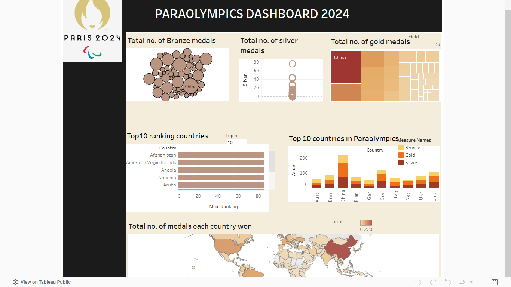

# 🏅 Paralympics 2024 Tableau Dashboard

This project is a dynamic and interactive Tableau dashboard that visualizes the medal performance of countries participating in the **Paralympic Games Paris 2024**. It aims to provide a data-driven lens for fans, analysts, and stakeholders to explore medal distribution, country rankings, and performance insights.

---

## 🎯 Business Objective

The purpose of this dashboard is to answer key questions from a sports analytics and stakeholder engagement perspective:

- **Which countries are leading in the Paralympics medal tally?**
- **How do gold, silver, and bronze medals distribute among nations?**
- **Which countries consistently rank high across all medal types?**
- **What is the global distribution of total medals?**

This visualization can support:
- **National Olympic Committees** tracking performance
- **Media outlets** highlighting top-ranking countries
- **Fans** comparing their country’s standing in real-time

---

## 📊 Dashboard Features

### 1. **Total Number of Bronze Medals (Bubble Chart)**
A bubble visualization that displays the distribution of bronze medals by country. The size of the bubble reflects the medal count.

### 2. **Total Number of Silver Medals (Dot Plot)**
A vertical dot plot representing how silver medals are distributed across participating nations.

### 3. **Total Number of Gold Medals (Treemap)**
A compact treemap that highlights the countries winning the highest number of gold medals, with China as the top performer.

### 4. **Top 10 Ranking Countries (Bar Chart)**
An adjustable chart that shows the top *n* countries based on total medal rankings.

### 5. **Top 10 Countries in Paralympics (Stacked Bar Chart)**
This visual breaks down the medal types (gold, silver, bronze) won by each top-performing country for deeper analysis.

### 6. **Total Medals by Country (World Map)**
A choropleth map showing geographic medal density, helping identify continental or regional dominance.

---

## 🔧 Tools & Technologies

- **Tableau Public** (Interactive Dashboard)
- **Calculated Fields** (for rankings and totals)
- **Parameters** (Top N selector)
- **Color Encoding & Hierarchies** (for medal types and categories)

---

## 📷 Dashboard Preview

---

## 👩‍💼 Author

**Divya Rathore**  
📍 Jaipur, Rajasthan  
📧 udawatdivya80@gmail.com  
🔗 [LinkedIn Profile](https://www.linkedin.com/in/divya-rathore-b95b5324b)

---

## 🔗 View Live Dashboard

> 👉 https://public.tableau.com/app/profile/divya.rathore3566/viz/paraolympictableaudashboard/Dashboard?publish=yes

---

## ⭐ Highlights

- Real-time comparison of medal trends
- Interactive filtering and ranking
- Useful for sports journalists, coaches, and national committees

If you like this project, ⭐ star it or fork it!

